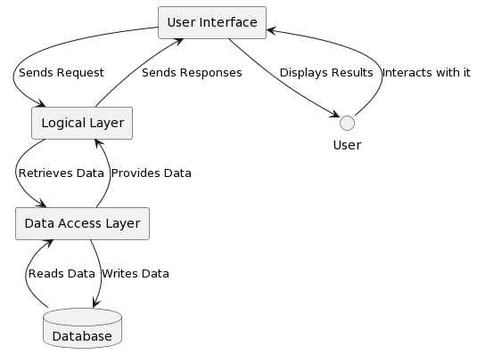

# Alkalmazás rétegei

### Megjelenítési réteg (Felhasználói felület)
Ez a réteg felelős a felhasználói felület megjelenítéséért. Ennek segítségével jelenítjük meg a kvíz témákat, kérdéseket. A kvíz kérdések esetén a hozzájuk tartozó válaszok, a pontszám és a hátralévő idő is látható. Emelett gombok segítségével lehetőséget ad a felhasználónak, hogy választ adjon a kérdésre vagy éppen témát válasszon, amit majd a logikai réteg teljesít.

A felületek létrehozásához HTML-t használunk, amit CSS segítségével formázunk. A gombok működtettését a JavaScript fogja segíteni.

A dinamikus elemek megjelenítését, mint például a kérdések, a pontszám és a hátralévő idő, ajax és jQuery segítségével lesznek megvalósítva, így nem kell új információ kiírásához lefrisíteni az oldalt.

### Logikai réteg
Az alkalmazás logikáját Python segítségével valósítjuk meg. Ide tartozik a kérdések lekérdezése, a helyes válaszok ellenőrzése és a pontszám számítása is. Ezen felül a kvíz játékmenetét is ebben a rétegben kezeljük. 
Maga a web framework-ot pedig a Flask fogja adni. 

### Adat elérési réteg
Ez a réteg felelős a kérdések eléréséért a kérdésbankból. A kvízkérdések .json fájljait Python segítségével dolgozzuk fel és témánként csoportosítjuk őket. A könnyebb átláthatóság érdekében a kérdések témánként külön .json fájlban lesznek tárolva.

### Diagram
<div hidden>
```
@startuml
rectangle "User Interface" as UI_Layer
rectangle "Logical Layer" as LOGIC_Layer
rectangle "Data Access Layer" as DATA_Layer
database "Database" as DB

UI_Layer --> LOGIC_Layer : Sends Request
LOGIC_Layer --> DATA_Layer : Retrieves Data
DATA_Layer <-- DB : Reads Data
DATA_Layer --> DB : Writes Data

DATA_Layer --> LOGIC_Layer : Provides Data
LOGIC_Layer --> UI_Layer : Sends Responses
UI_Layer --> User : Displays Results
User --> UI_Layer : Interacts with it

@enduml
```
</div>
