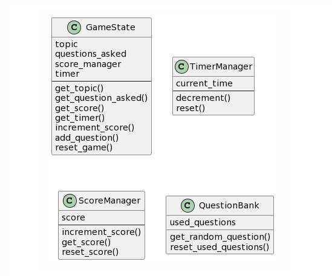

## Osztályterv

### GameState

- topic: az adott játék kérdéseinek témája
- question_asked: a már feltett kérdések
- score_manager: a pontozásért felelős adattag
- timer: az időzítésért felelős adattag
---
- increment_score(): növeli a megszerezett pontszámot
- add_question(): eltárolja a feltett kérdést
- reset_game(): újraindítja a játékot

### TimerManager

- current_time: a hátralévő idő
---
- decrement(): a számlálót csökkenti
- reset(): visszaállítja a számlálót

### ScoreManager

- score: a pontszám, intként tárolva
---
- increment_score(): a pontszám növeléséért felelős metódus
- reset_score(): a pontszám visszaállítása

### QuestionBank

- used_questions: a már feltett kérdések halmaza
---
- get_random_question(): egy véletlen, még nem választott kérdéssel tér vissza
- reset_used_questions(): visszaállítja a már használt kérdéseket