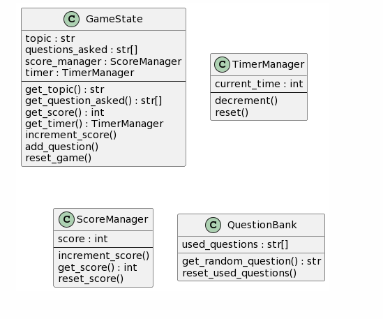

## Adat és Objektumspecifikációk



### GameState

- topic: az adott játék kérdéseinek témáját leíró string
- question_asked: a már feltett kérdések halmaza, amivel elkerülhető az újrakérdezés
- score_manager: a pontozásért felelős osztály egy példánya
- timer: az időzítő osztály egy példánya
---
- increment_score(): növeli a megszerezett pontszámot
- add_question(): a paraméterként adott kérdést felveszi a már feltett kérdések halmazába
- reset_game(): a játékot újraindító metódus

### TimerManager

- current_time: a hátralévő időt integerként tároló érték
---
- decrement(): a számlálót eggyel csökentő metódus
- reset(): a számlálót 10-re állító metódus

### ScoreManager

- score: a pontszám, intként tárolva
---
- increment_score(): pontszám növeléséért felelős metódus
- reset_score(): a pontszám visszaállítása 0-ra

### QuestionBank

- used_questions: a már feltett kérdések halmaza
---
- get_random_question(): egy véletlen, még nem választott kérdés szövegével visszatérő függvény
- reset_used_questions(): törli a már használt kérdések halmazát
---
```
@startuml
Class GameState {
 topic : str
 questions_asked : str[]
 score_manager : ScoreManager
 timer : TimerManager
 --
 get_topic() : str
 get_question_asked() : str[]
 get_score() : int
 get_timer() : TimerManager
 increment_score()
 add_question()
 reset_game()
}

Class TimerManager {
 current_time : int
 --
 decrement()
 reset()
}

Class ScoreManager {
 score : int
 --
 increment_score()
 get_score() : int
 reset_score()
}

Class QuestionBank {
 used_questions : str[]
 get_random_question() : str
 reset_used_questions()
}
@enduml
```